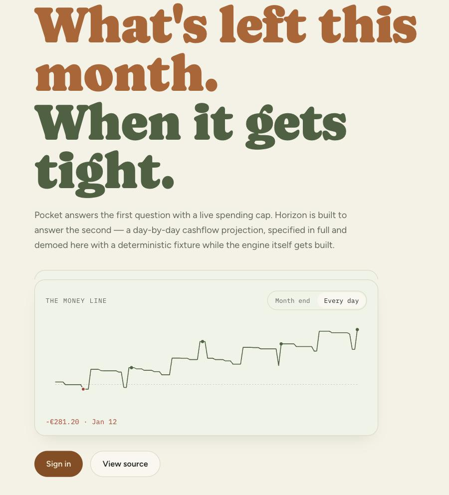

# Kapa — Pocket and Horizon

Vue 3 client for [Kapa](https://github.com/roman-mik/kapa-core), a family of household money
apps: **Pocket**, a monthly spending-cap tracker, and **Horizon**, a day-by-day, multi-currency
cashflow projector. All business logic, queries, and theming live in the private
`@roman-mik/kapa-core` package; this repo is the Vite + Vue 3 SPA that renders them, including
the public landing page below.

**Live:** [kapa-vue.vercel.app](https://kapa-vue.vercel.app)



## Pocket — shipped

A monthly spending cap, one tap per expense, always know what's left. The landing page's demo
panel isn't a mockup — it calls the same `@roman-mik/kapa-core` functions
(`remaining`, `safeDaily`, `spentPct`, `projection`, `pocketHomeView`) that the signed-in app
runs against real data.

## Horizon — in design

A day-by-day cashflow projection across accounts, currencies, and pay schedules — built to
answer the question Pocket can't: not just what's left this month, but when a comfortable
month-end balance hides a mid-month shortfall. The projection engine itself isn't built yet
(`kapa-core` currently only exposes `listAccounts` for it); the landing page demos the intended
behavior with a deterministic fixture standing in for the real engine, honestly marked
"in design" throughout.

## Architecture

- **`@roman-mik/kapa-core`** (private) — shared domain logic, Supabase queries, and theme
  tokens, consumed by this Vue SPA and the [Next.js `kapa`](https://github.com/roman-mik/kapa)
  app.
- **Supabase / Postgres** — the shared backend, with row-level security enforced at the
  database rather than the app layer.
- **This repo** — a Vite + Vue 3 SPA, offline-capable as an installable PWA.

## Engineering

- Row-level security enforced at the database, not just the app layer.
- pgTAP tests plus integration tests run through a real per-user JWT, so RLS is verified, not
  assumed.
- Generated Supabase types diffed in CI — a migration without regenerated types fails the
  build.
- Money stored as minor-unit integers everywhere; rounding happens only at display.
- FX rates are dated snapshots, converted at display time — never live-fetched at render.
- Offline-capable PWA with an installable app shell.

## Getting started

### Prerequisite: `NPM_TOKEN`

`@roman-mik/kapa-core` is a **private** package published to GitHub Packages, even though this
repo is public. Installing will fail with `401 Unauthorized` unless you have:

1. A **classic** GitHub PAT with `read:packages` scope (fine-grained tokens don't work for
   GitHub Packages).
2. That token exported as `NPM_TOKEN`, referenced from your **user-level** `~/.npmrc` (the
   underlying package manager refuses to expand env vars in a project-level `.npmrc`, since
   that file is committed):

   ```
   //npm.pkg.github.com/:_authToken=${NPM_TOKEN}
   ```

3. `NPM_TOKEN` set in your shell (`export NPM_TOKEN=...`) before installing, and as a repo/env
   secret in CI and Vercel.

The project's own `.npmrc` only maps the `@roman-mik` scope to the registry — it intentionally
does not carry the auth token.

### Commands

This project is built with [Vite+](https://vite.plus) — use `vp`, not `pnpm`, for everything:

```
vp install
vp dev
vp build
vp test
vp check
```
